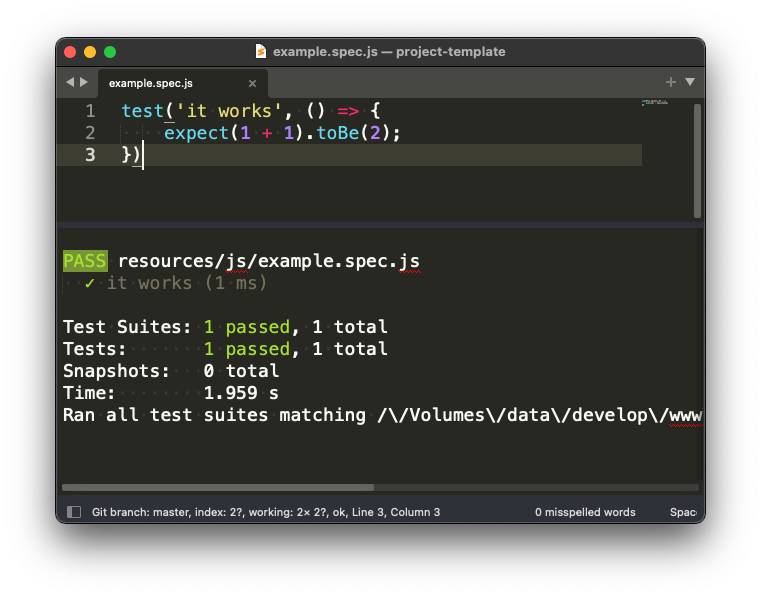

# Jester

[](https://github.com/absszero/sublime-jester/actions)

------------


A Jest test runner




## Installation

### Package Control

1. `Tools`  > `Command Palette`, then select `Package Control: Install Package`
2. Type `Jester`


## Commands

`Tools`  > `Command Palette`, and select following commands:

- `Jester: Test Sute` Run the whole test suite by current actived file.
- `Jester: Test File` Run all tests by current actived file.
- `Jester: Test Block` Run the test block by the cursor location.
- `Jester: Test Last` Run the last test.


## Key Bindings

`Tools`  > `Command Palette`, then select `Preferences: Key Bindings`.

Add your preferred key bindings.

```json
[
    { "keys": ["ctrl+shift+s"], "command": "jester_test_suite" },
    { "keys": ["ctrl+shift+f"], "command": "jester_test_file" },
    { "keys": ["ctrl+shift+b"], "command": "jester_test_block" },
    { "keys": ["ctrl+shift+l"], "command": "jester_test_last" }
]
```


## Configuration

`Tools`  > `Command Palette`, then select `Preferences: Settings`.

Add your configurations.

### jester.executable

You can instruct the test runner to use a custom Jest executable. If the package does not auto discover it.

```
"jester.executable": "~./node_modules/.bin/jest"
```


## Credits

Based initially on, and inspired by, [gerardroche/sublime-phpunit](https://github.com/gerardroche/sublime-phpunit/).

